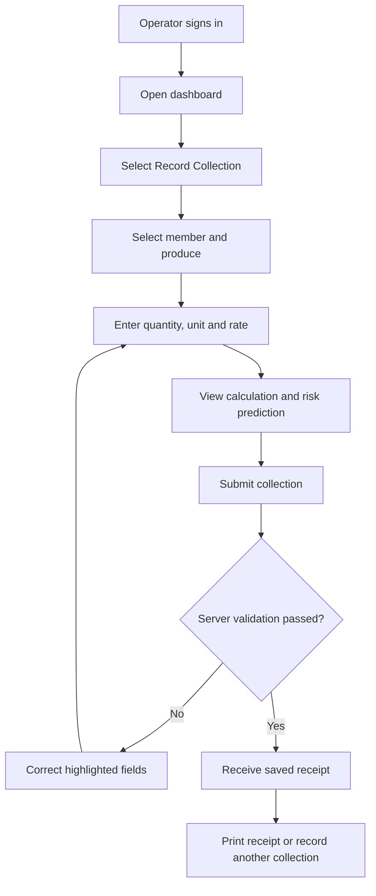
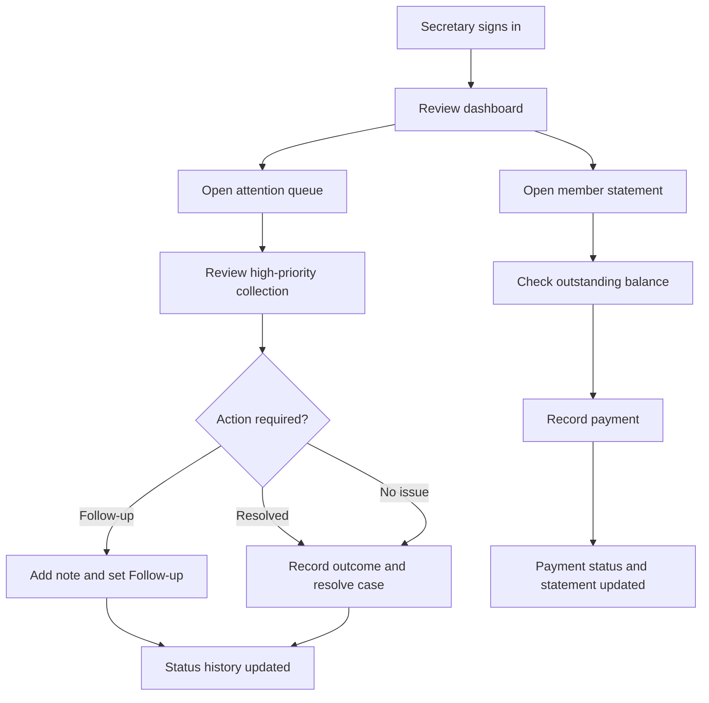
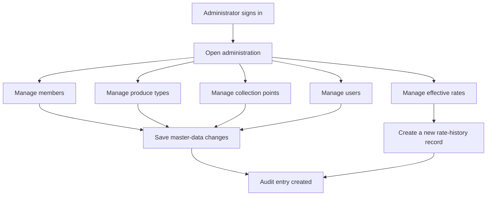
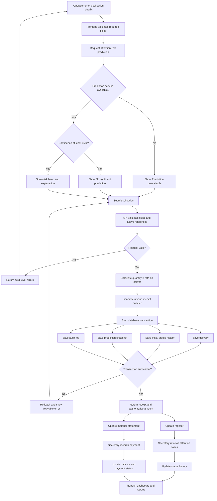
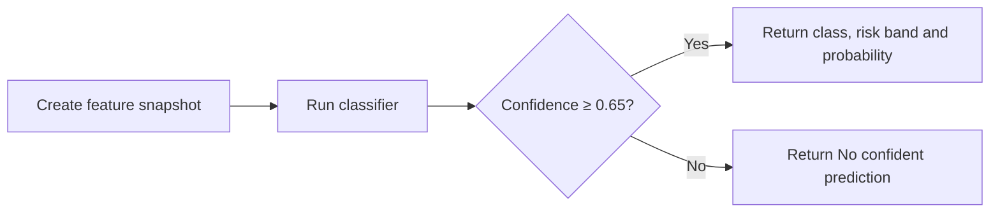
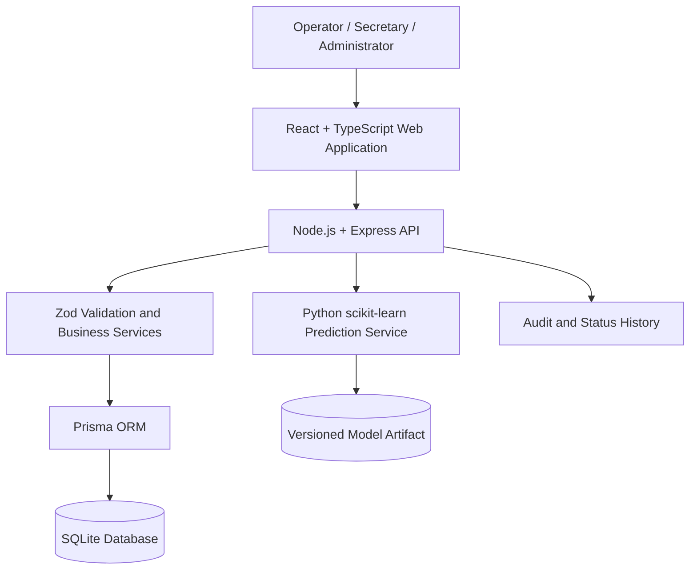
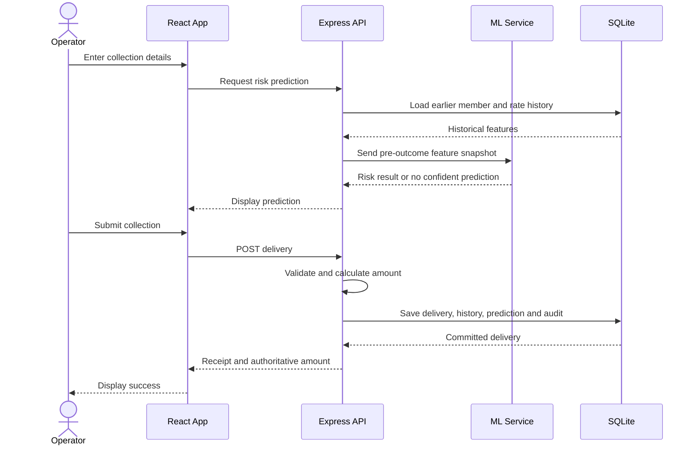
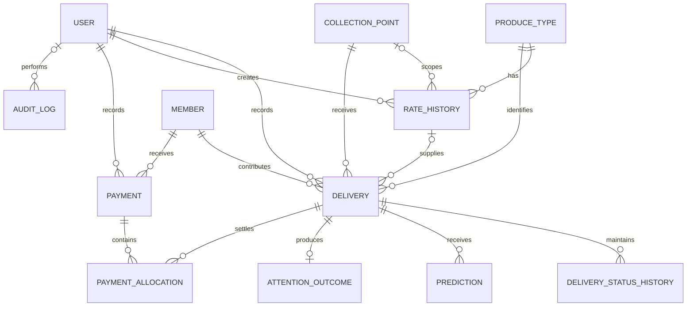

<div align="center">


# HarvestTrust

### Digital Produce Collection and Payment Register for Farmer Producer Groups

HarvestTrust replaces paper collection slips with a transparent digital system that records every farmer delivery, calculates the amount payable, tracks payments, produces member statements, and highlights collections that may require attention.

[](https://react.dev/)
[](https://www.typescriptlang.org/)
[](https://nodejs.org/)
[](https://scikit-learn.org/)
[](https://www.sqlite.org/)
[](https://www.prisma.io/)


[Overview](#-overview) ·
[Features](#-core-features) ·
[User Roles](#-users-and-role-based-flows) ·
[Workflow](#-end-to-end-workflow) ·
[Architecture](#-system-architecture) ·
[Installation](#-installation-and-setup) ·
[Testing](#-testing) ·
[Documentation](#-project-deliverables)

</div>

---

## 🌾 Overview

A Farmer Producer Group collects produce from its members and sells it in bulk. In the existing process, each delivery is written on a paper slip. Payments are calculated later by manually reviewing a bundle of slips.

This process is slow and difficult to verify. Slips may be lost, amounts may be calculated incorrectly, and farmers may dispute the quantity or rate recorded for their deliveries.

**HarvestTrust** provides a single digital register where every delivery is recorded against the correct member. The system validates the information, calculates the amount on the server, generates a receipt, maintains a complete history, and gives each member a clear statement of deliveries and payments.

> **One-sentence solution:** HarvestTrust records each farmer delivery immediately, calculates what the farmer is owed, and provides a transparent statement of deliveries, payments, and outstanding balance.

---

## 🎯 Project Objectives

- Digitally record every produce delivery.
- Connect each delivery to the correct farmer/member.
- Validate quantity, rate, unit, date, produce, and collection point.
- Calculate the authoritative amount on the backend.
- Generate a unique receipt for every collection.
- Preserve rate, payment, status, and audit history.
- Provide searchable and filterable collection records.
- Display records requiring attention before normal records.
- Generate clear member delivery and payment statements.
- Predict which collections may require manual review.
- Avoid forced predictions when model confidence is low.
- Handle loading, empty, error, validation, and success states.
- Improve transparency and trust within the producer group.

---

## 🚩 Problem and Solution

| Existing challenge | HarvestTrust solution |
|---|---|
| Deliveries are recorded on paper slips | Every delivery is stored in a digital register |
| Slips can be lost or damaged | Records are saved in a structured database |
| Amounts are calculated manually | Amounts are calculated automatically on the server |
| Farmers cannot easily verify entries | Every member receives a delivery and payment statement |
| Rate changes affect historical clarity | Rates are stored with effective-date history |
| Disputes are difficult to investigate | Status history, prediction snapshots, and audit logs are preserved |
| Secretaries scan every record manually | Attention cases are ordered and displayed first |
| Errors may fail silently | The UI clearly handles validation, loading, empty, and error states |

---

## ✨ Core Features

### 📊 Dashboard

- Today’s collected quantity
- Today’s collection value
- Total pending payment
- Active member count
- Open attention-case count
- Seven-day quantity and value trend
- Produce-wise distribution
- Recent collection activity
- High-priority attention queue
- Quick actions for collections, members, payments, and statements

### 🧺 Produce Collection

- Searchable member selection
- Produce and collection-point selection
- Quantity, unit, rate, quality grade, and moisture entry
- Live calculation preview
- Server-side authoritative calculation
- Attention-risk prediction before submission
- Unique receipt-number generation
- Transactional database save
- Printable receipt and collection summary

### 📋 Collection Register

- Search by member, receipt number, member code, or produce
- Filter by date, member, produce, collection point, payment status, and attention status
- Server-side sorting and pagination
- Attention-first default ordering
- Displayed and total record counts
- Loading skeletons, empty state, no-results state, and retryable errors
- Detailed collection view with calculation and status timeline

### 👨‍🌾 Member Management

- Add and update farmer members
- Unique member codes
- Active and inactive member status
- Member delivery history
- Total delivered quantity and value
- Payment history
- Outstanding balance
- Printable member statement

### 💳 Payment Management

- Record cash, bank transfer, UPI, cheque, or other payments
- Validate payment amount and member balance
- Prevent zero and negative payments
- Prevent accidental overpayment unless credit balance is explicitly enabled
- Maintain payment reference and notes
- Update delivery payment status and member balance
- Preserve payment and allocation history

### ⚠️ Attention Queue

- Display unresolved cases first
- Show risk band and model confidence
- Explain why the model highlighted a record
- Review, follow up, or resolve an attention case
- Record who changed the status and when
- Preserve all status changes instead of overwriting history

### 📈 Reports

- Date-wise collection summary
- Member delivery and payment statement
- Produce-wise quantity and value
- Outstanding-payment report
- Attention-case report
- Print-friendly layout
- CSV export for filtered data

---

## 👥 Users and Role-Based Flows

### Role Permissions

| Feature | Operator | Secretary | Administrator |
|---|:---:|:---:|:---:|
| View dashboard | ✅ | ✅ | ✅ |
| Record collection | ✅ | ✅ | ✅ |
| View collection register | ✅ | ✅ | ✅ |
| Edit permitted collection details | Limited | ✅ | ✅ |
| Review attention cases | View | ✅ | ✅ |
| Resolve attention cases | ❌ | ✅ | ✅ |
| View member statement | ✅ | ✅ | ✅ |
| Record farmer payment | ❌ | ✅ | ✅ |
| Add or update members | Limited | ✅ | ✅ |
| Manage produce types | ❌ | ❌ | ✅ |
| Manage collection points | ❌ | ❌ | ✅ |
| Manage rate history | ❌ | ❌ | ✅ |
| Manage users | ❌ | ❌ | ✅ |
| View audit logs | ❌ | Limited | ✅ |

### Operator User Flow



### Secretary User Flow



### Administrator User Flow



---

## 🔄 End-to-End Workflow



---

## 🧮 Calculation Logic

The browser may show a live estimate, but the backend independently calculates and stores the authoritative value.

```text
Gross Amount = Quantity × Rate per Unit
Net Amount   = Gross Amount - Total Deductions
Balance Due  = Total Delivery Value - Total Payments
```

For the current Easy-level implementation, deductions can be omitted:

```text
Net Amount = Gross Amount
```

### Verification Example

```text
Quantity      = 125.50 kg
Rate per unit = ₹32.40/kg

Amount = 125.50 × 32.40
Amount = ₹4,066.20
```

Money and quantity values use fixed-precision decimal handling. Client-provided totals are never trusted.

---

## 🤖 Machine-Learning Prediction

HarvestTrust includes a simple scikit-learn classifier that predicts whether a newly entered collection may require manual attention.

### Prediction Target

```text
Will this collection need manual attention?
```

The target represents a genuinely uncertain outcome such as:

- Member quantity dispute
- Unusual collection quantity
- Rate disagreement
- Repeated correction
- Missing supporting information

### Allowed Input Features

- Produce type
- Collection point
- Collection hour and day
- Quantity
- Rate per unit
- Calculated amount
- Quality grade or moisture, when available
- Difference from the member’s previous average quantity
- Difference from the historical median rate
- Number of previous member deliveries
- Number of previous reviewed attention cases
- Availability of optional supporting details

### Leakage Prevention

The following fields are excluded because they would not exist at prediction time:

- Final attention outcome
- Resolution reason
- Resolution timestamp
- Final payment status
- Future corrections
- Payment delay known only after collection

### Confidence Handling



The prediction supports human review; it does not replace the secretary’s decision. If the Python model is unavailable, the collection can still be saved.

### Training Requirements

- Deterministic synthetic history for demonstration
- Train/test split before training
- `random_state=42`
- Stratified split when possible
- scikit-learn `Pipeline`
- Logistic Regression or another simple standard classifier
- Precision, recall, F1 score, confusion matrix, and class distribution
- Saved model artifact using joblib
- Model version and original feature snapshot stored with predictions

---

## 🏗️ System Architecture



### Request Sequence



---

## 🧰 Technology Stack

| Layer | Technology | Purpose |
|---|---|---|
| Frontend | React 19 | Component-based user interface |
| Language | TypeScript | Type-safe frontend and backend development |
| Build tool | Vite | Fast development and production builds |
| Styling | Tailwind CSS | Responsive utility-first styling |
| UI components | shadcn/ui | Accessible reusable components |
| Animation | Framer Motion | Page transitions and meaningful interactions |
| Icons | Lucide React | Consistent interface icons |
| Charts | Recharts | Dashboard and report visualization |
| Routing | React Router | Client-side navigation |
| Backend | Node.js and Express | REST API and business logic |
| Validation | Zod | Server-side request validation |
| ORM | Prisma | Database schema, migration, and access |
| Database | SQLite | Portable local database for assessment |
| Machine learning | Python and scikit-learn | Attention-risk classification |
| Model storage | joblib | Versioned trained-model artifact |
| Frontend testing | Vitest and React Testing Library | Component and user-state tests |
| API testing | Vitest/Jest and Supertest | Endpoint and integration tests |
| Diagramming | Mermaid | ER, architecture, and workflow diagrams |

---

## 🗃️ Database Design

| Entity | Purpose |
|---|---|
| `User` | Operators, secretaries, and administrators |
| `Member` | Farmer/member identity and contact information |
| `ProduceType` | Produce names, codes, and valid units |
| `CollectionPoint` | Produce collection locations |
| `RateHistory` | Effective-dated produce rates |
| `Delivery` | Individual produce collection records |
| `DeliveryStatusHistory` | Append-only attention and payment status changes |
| `Payment` | Payments made to members |
| `PaymentAllocation` | Payment-to-delivery allocations |
| `Prediction` | Risk class, confidence, features, and model version |
| `AttentionOutcome` | Secretary-reviewed result used as the model target |
| `AuditLog` | Important entity and user actions |

### Simplified ER Diagram



### Main Design Decisions

1. Members, deliveries, produce types, rates, collection points, and payments are separate entities so each business fact is stored only once.
2. Every delivery stores the exact quantity and rate used when it was created, preventing later rate changes from altering historical receipts.
3. Rate and status changes are appended to history tables rather than overwriting the only available evidence.
4. Predictions store the original feature snapshot, confidence threshold, and model version, making predictions auditable.

---

## 🔌 API Overview

All APIs use a consistent success or error envelope.

### Success Response

```json
{
  "success": true,
  "data": {},
  "meta": {},
  "requestId": "request-id"
}
```

### Error Response

```json
{
  "success": false,
  "error": {
    "code": "VALIDATION_ERROR",
    "message": "Please correct the highlighted fields.",
    "fieldErrors": {
      "quantity": "Quantity must be greater than zero."
    }
  },
  "requestId": "request-id"
}
```

### Main Endpoints

| Method | Endpoint | Purpose |
|---|---|---|
| `POST` | `/api/auth/login` | Authenticate a user |
| `GET` | `/api/dashboard` | Load dashboard metrics |
| `GET` | `/api/members` | Search and list members |
| `POST` | `/api/members` | Create a member |
| `GET` | `/api/members/:id` | View member details |
| `PATCH` | `/api/members/:id` | Update permitted member fields |
| `GET` | `/api/members/:id/statement` | Generate member statement |
| `GET` | `/api/produce-types` | List active produce types |
| `GET` | `/api/collection-points` | List active collection points |
| `GET` | `/api/rates/current` | Get the effective rate |
| `GET` | `/api/deliveries` | Search, filter, order, and paginate deliveries |
| `POST` | `/api/deliveries` | Validate and create a delivery |
| `GET` | `/api/deliveries/:id` | View delivery and history |
| `PATCH` | `/api/deliveries/:id` | Update permitted fields |
| `POST` | `/api/deliveries/:id/attention-status` | Append attention status |
| `POST` | `/api/predictions/attention` | Request attention-risk prediction |
| `GET` | `/api/attention` | Load unresolved attention queue |
| `POST` | `/api/payments` | Record a member payment |
| `GET` | `/api/payments` | Search payment history |
| `GET` | `/api/reports/summary` | Load collection summary |
| `GET` | `/api/reports/outstanding` | Load outstanding balances |
| `GET` | `/api/health` | Check API and database readiness |

---

## 📁 Project Structure

```text
harvesttrust/
├── apps/
│   ├── web/
│   │   ├── public/
│   │   ├── src/
│   │   │   ├── components/
│   │   │   ├── features/
│   │   │   │   ├── auth/
│   │   │   │   ├── dashboard/
│   │   │   │   ├── deliveries/
│   │   │   │   ├── members/
│   │   │   │   ├── payments/
│   │   │   │   ├── attention/
│   │   │   │   ├── reports/
│   │   │   │   └── settings/
│   │   │   ├── hooks/
│   │   │   ├── layouts/
│   │   │   ├── lib/
│   │   │   ├── pages/
│   │   │   ├── routes/
│   │   │   ├── styles/
│   │   │   └── tests/
│   │   ├── index.html
│   │   ├── package.json
│   │   └── vite.config.ts
│   │
│   └── api/
│       ├── prisma/
│       │   ├── migrations/
│       │   ├── schema.prisma
│       │   └── seed.ts
│       ├── src/
│       │   ├── controllers/
│       │   ├── middleware/
│       │   ├── repositories/
│       │   ├── routes/
│       │   ├── services/
│       │   ├── utils/
│       │   ├── validators/
│       │   └── tests/
│       └── package.json
│
├── ml/
│   ├── data/
│   ├── model/
│   ├── tests/
│   ├── generate_demo_history.py
│   ├── predict.py
│   ├── requirements.txt
│   └── train.py
│
├── docs/
│   ├── screenshots/
│   ├── architecture.md
│   ├── calculation-verification.md
│   ├── database-constraint-tests.md
│   ├── demo-script.md
│   ├── er-diagram.md
│   ├── model-card.md
│   └── test-report.md
│
├── presentation/
├── presentation.pdf
├── .env.example
├── .gitignore
├── LICENSE
├── package.json
└── README.md
```

---

## 🚀 Installation and Setup

### Prerequisites

Install the following:

- Node.js 20 or later
- npm 10 or later
- Python 3.10 or later
- Git

SQLite does not require a separate database server.

### 1. Clone the Repository

```bash
git clone https://github.com/<your-username>/harvesttrust.git
```

```bash
cd harvesttrust
```

### 2. Install Node.js Dependencies

```bash
npm install
```

### 3. Configure Environment Variables

```bash
cp .env.example .env
```

Example configuration:

```env
NODE_ENV=development
PORT=4000
WEB_URL=http://localhost:5173
API_URL=http://localhost:4000
DATABASE_URL=file:./dev.db
JWT_SECRET=replace-with-a-long-random-value
ML_SERVICE_URL=http://localhost:5001
PREDICTION_CONFIDENCE_THRESHOLD=0.65
```

### 4. Generate the Prisma Client

```bash
npm run db:generate
```

### 5. Run Database Migrations

```bash
npm run db:migrate
```

### 6. Seed Demo Data

```bash
npm run db:seed
```

### 7. Create the Python Environment

```bash
cd ml
```

```bash
python3 -m venv venv
```

```bash
source venv/bin/activate
```

For Windows PowerShell:

```powershell
.\venv\Scripts\Activate.ps1
```

### 8. Install Machine-Learning Dependencies

```bash
pip install -r requirements.txt
```

### 9. Generate Demo Training History

```bash
python generate_demo_history.py
```

### 10. Train the Model

```bash
python train.py
```

### 11. Return to the Project Root

```bash
cd ..
```

### 12. Start the Application

```bash
npm run dev
```

Expected local services:

| Service | URL |
|---|---|
| Web application | `http://localhost:5173` |
| REST API | `http://localhost:4000` |
| API health check | `http://localhost:4000/api/health` |
| ML service | `http://localhost:5001` |

---

## 🔐 Demo Accounts

These accounts should be created by the seed script:

| Role | Email | Password |
|---|---|---|
| Operator | `operator@harvesttrust.local` | `Operator@123` |
| Secretary | `secretary@harvesttrust.local` | `Secretary@123` |
| Administrator | `admin@harvesttrust.local` | `Admin@123` |

> Demo credentials are for local assessment use only. Replace all passwords before deploying the application.

---

## 🧪 Testing

### Run All JavaScript and TypeScript Tests

```bash
npm test
```

### Run API Integration Tests

```bash
npm run test:api
```

### Run Frontend Tests

```bash
npm run test:web
```

### Run Machine-Learning Tests

```bash
cd ml
```

```bash
source venv/bin/activate
```

```bash
python -m pytest
```

### Main End-to-End Verification

1. Sign in as the Operator.
2. Open **Record Collection**.
3. Select a seeded farmer.
4. Select a produce type and collection point.
5. Enter `125.50 kg`.
6. Enter a rate of `₹32.40/kg`.
7. Confirm the calculated amount is `₹4,066.20`.
8. Save the collection.
9. Confirm the receipt number is generated.
10. Refresh the collection register.
11. Confirm the saved record still appears.
12. Open the member statement.
13. Confirm the delivery value and balance are updated.

### Invalid Insert Tests

The system must reject:

- Zero quantity
- Negative quantity
- Zero rate
- Negative rate
- Missing member
- Nonexistent produce type
- Unsupported unit
- Invalid moisture percentage
- Inactive collection point
- Duplicate receipt number

Exact database constraint errors should be recorded in:

```text
docs/database-constraint-tests.md
```

After the invalid tests, run a valid insert to confirm the database remains operational.

---

## 🛡️ Validation, Security, and Reliability

- Server-side validation for every write operation
- Fixed-precision decimal handling
- Foreign-key and unique constraints
- Database transactions for multi-table writes
- Password hashing using bcrypt or Argon2
- JWT/session protection for authenticated routes
- Role-based authorization
- Helmet security headers
- Restricted CORS configuration
- Rate limiting for authentication and sensitive endpoints
- Structured request IDs and error logging
- No passwords, tokens, or personal information in logs
- Graceful model-service failure
- Health endpoint for API and database readiness

---

## ♿ Accessibility and Responsive Design

- Semantic headings and page landmarks
- Keyboard-accessible forms, menus, dialogs, and tables
- Visible focus indicators
- ARIA live regions for success and error notifications
- Text and icons in addition to status colors
- Accessible labels and descriptions
- Sufficient color contrast
- `prefers-reduced-motion` support
- Desktop, tablet, and mobile layouts
- Mobile-friendly collection form with sticky submit action
- No horizontal page scrolling at 360-pixel width

---

## 🎨 Visual Design and Animation

HarvestTrust uses an agriculture-focused visual language:

- Forest green and harvest amber color palette
- Warm cream backgrounds and clean white surfaces
- Field-line, grain, leaf, basket, scale, receipt, and payment motifs
- Animated dashboard values
- Smooth page transitions
- Staggered dashboard-card entrance
- Skeleton loading states
- Weighing-scale calculation animation
- Receipt success animation
- Gentle chart transitions
- Smooth table-row updates
- Reduced-motion alternative for accessibility

Animations are purposeful and never block collection entry or keyboard interaction.

---

## 📸 Application Screenshots

Add screenshots from the actual running application to `docs/screenshots/`.

| Dashboard | Record Collection |
|---|---|
| `docs/screenshots/dashboard.png` | `docs/screenshots/record-collection.png` |

| Collection Register | Member Statement |
|---|---|
| `docs/screenshots/collection-register.png` | `docs/screenshots/member-statement.png` |

| Attention Queue | Saved Receipt |
|---|---|
| `docs/screenshots/attention-queue.png` | `docs/screenshots/saved-receipt.png` |

Do not use generic mock-ups in the final submission. Capture screenshots from the running application.

---

## 📦 Seed Data

The deterministic seed should create:

- 3 users covering all roles
- 25-40 fictional farmer members
- 6-10 produce types
- 2-4 collection points
- Historical produce rates
- At least 100 visible deliveries
- At least 30 payments
- Paid, partially paid, and unpaid records
- Open, follow-up, resolved, and normal attention cases
- 250-500 synthetic historical examples for model training

All generated data is fictional and intended only for demonstration.

---

## 📚 Project Deliverables

| Deliverable | Location |
|---|---|
| Application source code | `apps/` |
| Database schema | `apps/api/prisma/schema.prisma` |
| Database migrations | `apps/api/prisma/migrations/` |
| Seed script | `apps/api/prisma/seed.ts` |
| Machine-learning scripts | `ml/` |
| Trained-model artifact | `ml/model/` |
| ER diagram | `docs/er-diagram.md` |
| Architecture document | `docs/architecture.md` |
| Model card | `docs/model-card.md` |
| Constraint-test evidence | `docs/database-constraint-tests.md` |
| Hand calculation verification | `docs/calculation-verification.md` |
| Test report | `docs/test-report.md` |
| Screenshots | `docs/screenshots/` |
| Demo script | `docs/demo-script.md` |
| Presentation | `presentation.pdf` |
| Project instructions | `README.md` |

---

## 🎥 Demonstration Flow

The recommended demonstration takes approximately 3-5 minutes:

1. Introduce the paper-slip problem.
2. Sign in as the Operator.
3. Show the dashboard.
4. Record a new collection.
5. Verify the `₹4,066.20` calculation.
6. Display the saved receipt.
7. Refresh the register to prove persistence.
8. Search and filter collection records.
9. Show attention-first ordering.
10. Sign in as the Secretary.
11. Review an attention case.
12. Open a member statement and record a payment.
13. Show a low-confidence prediction case.
14. Briefly show the ER diagram and test report.
15. Finish with the next planned improvement.

---

## 🗺️ Future Improvements

- SMS or WhatsApp delivery receipts
- Offline-first collection-point entry
- Automatic synchronization when connectivity returns
- Farmer self-service mobile application
- Regional-language support
- QR-coded member cards
- Digital weighing-scale integration
- Bank and UPI payment integration
- Multi-group and multi-tenant support
- PostgreSQL production deployment
- Scheduled model monitoring and retraining

---

## ✅ Assessment Completion Checklist

- [ ] New collection works from UI to database
- [ ] Server validates every collection field
- [ ] Server calculates the authoritative amount
- [ ] Receipt number is generated
- [ ] Delivery, history, prediction, and audit save transactionally
- [ ] Database is normalized
- [ ] Rate and status history are preserved
- [ ] ER diagram is included
- [ ] Model uses only information available at prediction time
- [ ] Train/test split and fixed random seed are used
- [ ] Low-confidence cases return no forced prediction
- [ ] Register supports search, filters, ordering, count, and pagination
- [ ] Attention cases appear first
- [ ] Member statements show delivery, payment, and balance
- [ ] Invalid database inserts and exact errors are documented
- [ ] A valid insert succeeds after invalid tests
- [ ] Loading, empty, no-results, success, and error states exist
- [ ] Application screenshots are captured
- [ ] Tests are run and results are documented honestly
- [ ] `presentation.pdf` contains 6-8 verified slides
- [ ] Demo video is recorded
- [ ] Everything is uploaded to one public GitHub repository

---

## 👨‍💻 Project Information

| Field | Details |
|---|---|
| Project | HarvestTrust |
| Assessment | SIH 2026 - Internal Practical Assessment |
| Student | JANARTHANAN V |
| Register Number | 411723205021 |
| Institution | PSVPEC |
| Department | Information Technology |
| Year | IV |
| Level | Easy |
| Duration | 2 days |
| Marks | 70 |

---

## 📄 License

This project is available under the [MIT License](LICENSE).

---

<div align="center">

### 🌱 From paper slips to trusted digital records

**HarvestTrust — Every delivery recorded. Every payment explained.**


</div>
