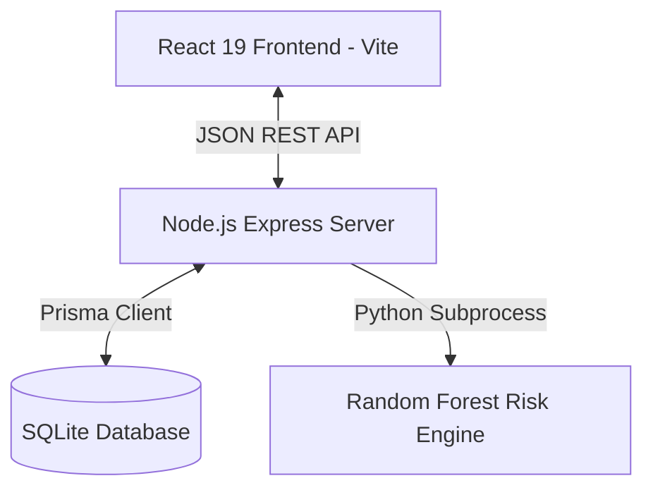
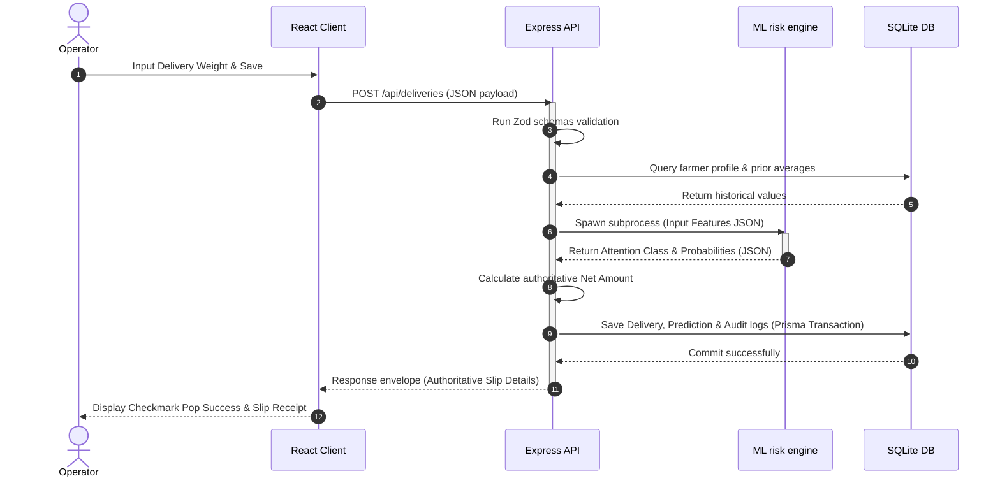

# Architecture Overview - HarvestTrust

HarvestTrust is designed with a decoupled monorepo architecture, splitting concerns between a React TypeScript single-page application client, a Node.js Express API server, and an offline Python machine learning prediction module.

## 1. System Block Diagram

- **Frontend Client (Vite + React 19 + Tailwind CSS v4):** Serves the responsive client SPA layout. It features Recharts charts, Lucide icon libraries, and custom visual transitions.
- **Backend API (Express + TypeScript + Prisma):** Serves JSON endpoints, manages database transactions, executes input validators, and maps ORM relations.
- **SQLite Database:** Local-first file storage containing separate, indexed rate and status histories.
- **Python Subprocess risk engine:** Loads the random forest pipeline, calculates relative history indicators, and writes prediction probabilities to standard output.

---

## 2. End-to-End Collection Request Flow

