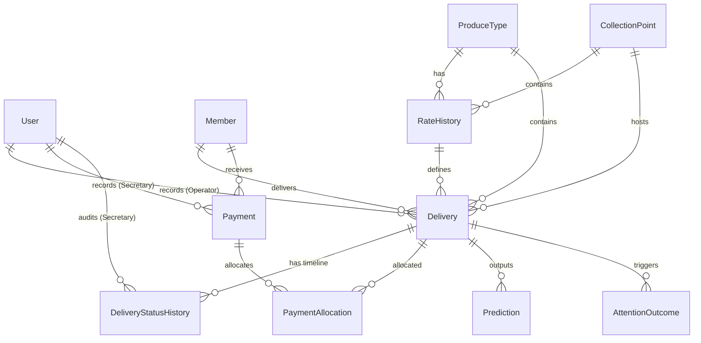

# Entity Relationship Diagram - HarvestTrust

This document maps the normalized database schema used in HarvestTrust.

## 1. ER Diagram (Mermaid)

---

## 2. Entity Details

### User
- Handles login details and user role authorizations (`OPERATOR`, `SECRETARY`, `ADMIN`).

### Member
- Stores farmer contact metadata, village names, and join date timestamps.

### ProduceType
- Defines crop categories (e.g. Paddy, tomato, groundnut) and their standard regional units (kg, quintal, crate).

### CollectionPoint
- Identifies geographical check scales where operators weigh incoming produce.

### RateHistory
- Tracks price fluctuations over time for specific produce and collection point coordinates.

### Delivery
- Stores delivery quantities, grades, server-calculated values, and review flags.

### Payment
- Logs payments issued to members.

### PaymentAllocation
- Maps individual payment transactions to specific delivery records, allowing precise calculations of outstanding balances.

### Prediction
- Records attention probabilities, input feature vectors, and confidence metrics returned by the ML subprocess.

---

## 3. Database Design Justification

1. **Normalized Separation:** Members, produce types, collection points, deliveries, and payments are stored in separate, normalized tables to ensure data integrity and avoid duplicate updates.
2. **Immutable Delivery Rates:** Delivery records copy the exact rate used at transaction time. This ensures that subsequent modifications to `RateHistory` will never alter past calculation totals or farmer statement balances.
3. **Append-Only History Logs:** Rate revisions and attention review outcomes are tracked as append-only timelines (`RateHistory`, `DeliveryStatusHistory`), providing complete accountability.
4. **Independent ML Audits:** Predictions store their input feature snapshots and model versions, allowing post-hoc auditing of the ML classifier without risking future data leakage.
