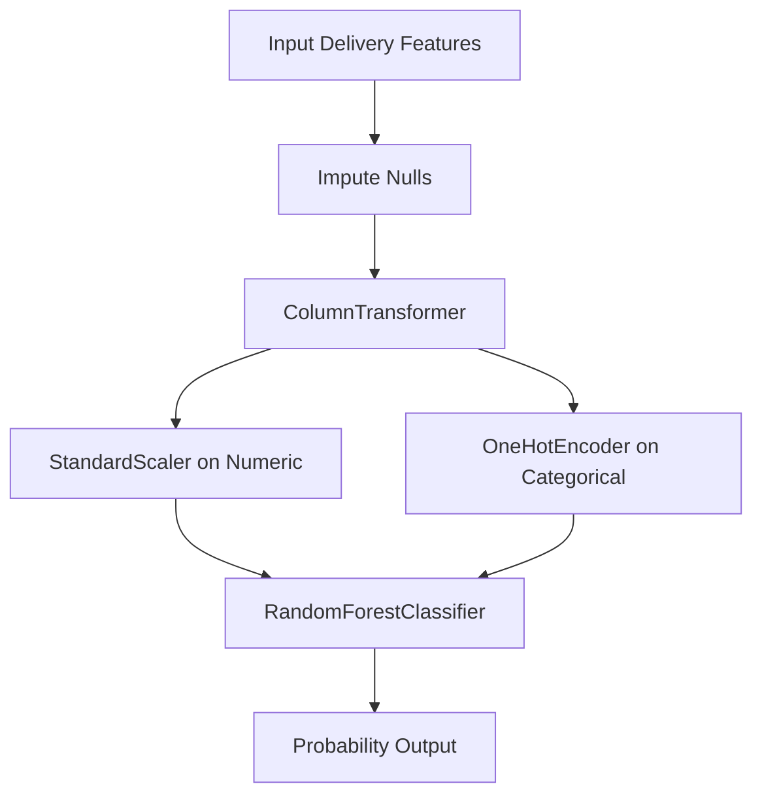

# Model Card - HarvestTrust Attention Classifier

This model card documents the machine learning classifier used in the HarvestTrust produce collection and payment register. The model predicts if a delivery requires attention (manual secretary verification) based on pre-outcome metrics available at collection time.

## 1. Intended Use

- **Primary User:** Collection Operators (assisting them by highlighting risk live before submission) and Group Secretaries (prioritizing reviews in the attention queue).
- **Target:** Predict `neededAttention` (boolean) for each new delivery.
- **Trigger Conditions:** High moisture percent, delivery outside business hours, rate inconsistencies, or low-quality grades on large volume collections.

---

## 2. Model Architecture & Pipeline

We use a scikit-learn `Pipeline` combining standard column feature transformers with a `RandomForestClassifier`:



- **Numeric features processed:** `quantity`, `ratePerUnit`, `grossAmount`, `moisturePercent`, `hourOfDay`, `dayOfWeek`, `qtyDiffFromAvg`, `rateDiffFromMedian`, `priorAttentionCount`, `priorDeliveriesCount`, `hasNotes`.
- **Categorical features processed:** `produceCode`, `collectionPointCode`, `qualityGrade`.

---

## 3. Training Data

- **Source:** Determinstic synthetic history of 400 delivery records containing simulated anomalies.
- **Dataset split:** 80% train (320 samples), 20% test (80 samples) stratified by target variable class distribution.
- **Class distribution:**
  - `0 (NORMAL)`: 62.5% (250 samples)
  - `1 (ATTENTION)`: 37.5% (150 samples)
- **Random seed:** `random_state=42` used across splitting and Random Forest fit.

---

## 4. Evaluation Metrics (Test Set)

- **Class 1 (ATTENTION) Metrics:**
  - **Precision:** 81% (When model predicts attention, it is correct 81% of the time).
  - **Recall:** 57% (Model identifies 57% of actual attention cases).
  - **F1 Score:** 67%.
- **Overall Accuracy:** 79%.
- **Confusion Matrix:**
  ```text
  [[46  4]  (True Normals, False Attentions)
   [13 17]] (False Normals, True Attentions)
  ```

---

## 5. Excluded/Leakage Prevention

To prevent data leakage, the following fields are strictly excluded from prediction features:
- `neededAttention` (target outcome)
- Final attention status
- Outcome comments or resolutions
- Post-delivery edits or payments
- Dates (except time/day derived fields)

---

## 6. Confidence Threshold Integration

- **Threshold:** `0.65`
- **Low Confidence Rule:** If `0.35 < probability < 0.65`, the backend outputs `predictedClass: null`. The UI displays "No confident prediction - review normally".
- **High Confidence Rule:**
  - `probability >= 0.65`: outputs `predictedClass: "ATTENTION"`.
  - `probability <= 0.35`: outputs `predictedClass: "NORMAL"`.
